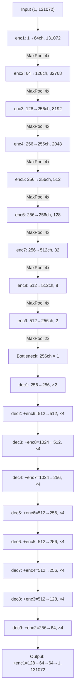

# 🔬 Deep Technical Research — NMR Spectral Decomposition

> This document contains the full technical deep-dive into all repos and papers.
> Use this as the **technical reference** when building the model.

---

## 1. SENNet — Complete Architecture Analysis

📁 **Repo**: [repos/SENNet](file:///c:/Extra%20Programs/Files/BioTech/repos/SENNet)
📄 **Model Code**: [models_baseline_0711.py](file:///c:/Extra%20Programs/Files/BioTech/repos/SENNet/models_baseline_0711.py)

### 1.1 Architecture Overview

The model is a deep **1D U-Net** called `uNet9` — 9 encoder stages + 9 decoder stages.

```
Input: (Batch, 1, 131072)  →  Output: (Batch, 1, 131072)
       ↑ single channel          ↑ single channel
       ↑ 128k data points        ↑ macromolecule spectrum
```

- **~10-15 Million parameters**
- **NO BatchNorm, NO Dropout** — surprisingly simple
- **ReLU activations** throughout
- **All Conv1D layers have `bias=False`**

### 1.2 Encoder (Downsampling) Path

Each stage = `convBlock` (two Conv1d layers, kernel=3, padding=1) + MaxPool1d

| Stage | Channels | Length After Pool | Pool Params |
|-------|----------|-------------------|-------------|
| enc1 | 1 → 64 | 131,072 → 32,768 | k=4, s=4 |
| enc2 | 64 → 128 | 32,768 → 8,192 | k=4, s=4 |
| enc3 | 128 → 256 | 8,192 → 2,048 | k=4, s=4 |
| enc4 | 256 → 256 | 2,048 → 512 | k=4, s=4 |
| enc5 | 256 → 256 | 512 → 128 | k=4, s=4 |
| enc6 | 256 → 256 | 128 → 32 | k=4, s=4 |
| enc7 | 256 → 512 | 32 → 8 | k=4, s=4 |
| enc8 | 512 → 512 | 8 → 2 | k=4, s=4 |
| enc9 | 512 → 256 | 2 → 1 | k=2, s=2 |

> **Bottleneck**: 256 channels × 1 data point — the entire 128k spectrum compressed into 256 features!

### 1.3 Decoder (Upsampling) Path + Skip Connections

Uses `ConvTranspose1d` for upsampling. Skip connections concatenate encoder output.

| Stage | Skip From | Input Channels | Output Channels | Length |
|-------|-----------|---------------|-----------------|--------|
| dec1 | — | 256 | 256 | 1 → 2 |
| dec2 | enc9 | 256+256=512 | 512 | 2 → 8 |
| dec3 | enc8 | 512+512=1024 | 512 | 8 → 32 |
| dec4 | enc7 | 512+512=1024 | 256 | 32 → 128 |
| dec5 | enc6 | 256+256=512 | 256 | 128 → 512 |
| dec6 | enc5 | 256+256=512 | 256 | 512 → 2,048 |
| dec7 | enc4 | 256+256=512 | 256 | 2,048 → 8,192 |
| dec8 | enc3 | 256+256=512 | 128 | 8,192 → 32,768 |
| dec9 | enc2 | 128+128=256 | 64 | 32,768 → 131,072 |

### 1.4 Output Layer

```python
# Concatenate dec9 (64ch) + enc1 (64ch) = 128ch
Conv1d(128, 64, kernel=3, padding=1) → ReLU
Conv1d(64, 64, kernel=3, padding=1) → ReLU  
Conv1d(64, 1, kernel=1)  # Final projection to single channel
```

### 1.5 Architecture Diagram



---

## 2. SENNet — Training Data Generation

📄 **Notebook**: [training_dataset.ipynb](file:///c:/Extra%20Programs/Files/BioTech/repos/SENNet/training_dataset.ipynb)

### 2.1 Mathematical Model

NMR peaks are simulated using the **Free Induction Decay (FID)** formula:

$$FID(t) = A_0 \cdot e^{i \cdot 2\pi f t} \cdot e^{-t/T_2}$$

Where:
- $A_0$ = amplitude
- $f$ = frequency (chemical shift in Hz)
- $T_2$ = spin-spin relaxation time (controls linewidth)
- After FFT → produces a **Lorentzian** peak in frequency domain

### 2.2 Key Insight — Linewidth Separates Molecule Types

$$\text{Linewidth at half height} = \frac{1}{\pi \cdot T_2}$$

| Molecule Type | T₂ | Linewidth | Peak Shape |
|--------------|-----|-----------|------------|
| Small molecules | Long T₂ | Narrow, sharp | ↑ tall thin |
| Macromolecules | Short T₂ | Broad, wide | ⌢ short fat |

> **SENNet's threshold**: 3.66 Hz linewidth — peaks broader than this = macromolecule

### 2.3 Synthetic Data Pipeline

```
1. Sample random parameters:
   - f (frequency): random positions across spectral range
   - A0 (amplitude): random from target distribution  
   - T2 (relaxation): random — SHORT for macro, LONG for small

2. Generate FIDs for each peak:
   FID_peak = A0 * exp(1j*2π*f*t) * exp(-t/T2)

3. Sum all peaks:
   FID_mixture = Σ FID_peaks

4. Add white Gaussian noise

5. FFT → frequency domain spectrum

6. Set water region (4.657-5.130 ppm) to zero

7. Ground truth = ONLY the macromolecule peaks
   (model learns to extract these from mixture)
```

### 2.4 SENNet Inference Pipeline

```python
# 1. Load real NOESY spectrum (.npy file)
spectrum = np.load("MTBLS242_noesypr1d_10.npy")

# 2. Baseline correction
spectrum -= spectrum[120000:121000].min()  # subtract background

# 3. Truncate to 14.7 ppm to -5.3 ppm range

# 4. Interpolate to exactly 131,072 (128*1024) points  
spectrum = np.interp(new_x, old_x, spectrum)

# 5. Min-Max normalize (using region 70000:120000)

# 6. Run model
macro_spectrum = model(spectrum)           # output = macromolecules
small_spectrum = spectrum - macro_spectrum  # subtraction = small molecules
```

---

## 3. NMR-Onion — Peak Physics & Lineshape Models

📁 **Repo**: [repos/NMR-Onion](file:///c:/Extra%20Programs/Files/BioTech/repos/NMR-Onion)

### 3.1 Three Peak Lineshape Models

> [!IMPORTANT]
> These mathematical models describe how real NMR peaks look. Critical for generating realistic synthetic training data.

#### Model 1: Lorentzian (Standard exponential decay)

$$Z(t) = e^{i \cdot 2\pi f t} \cdot e^{-\alpha t}$$

- Simplest model, pure exponential decay
- Most NMR textbooks assume this
- Real peaks often deviate from pure Lorentzian

#### Model 2: Pseudo-Voigt (Lorentzian + Gaussian mixture)

$$Decay(t) = (1-\eta) \cdot e^{-\alpha t} + \eta \cdot e^{-\alpha t^2}$$

- $\eta \in [0, 1]$ controls the mix (constrained via sigmoid)
- $\eta = 0$ → pure Lorentzian
- $\eta = 1$ → pure Gaussian
- **More realistic** than pure Lorentzian

#### Model 3: Generalized Voigt (Variable power law)

$$Decay(t) = e^{-\alpha \cdot t^e}$$

- Power parameter $e$ morphs between distributions
- $e = 1$ → Lorentzian, $e = 2$ → Gaussian
- **Most flexible** model

### 3.2 Optimization Approach

NMR-Onion uses **Variable Projection (VARPRO)**:
- Separates parameters into **non-linear** (frequencies, decay rates) and **linear** (amplitudes)
- Non-linear params optimized via **L-BFGS** (PyTorch optimizer)
- Linear params solved exactly via least-squares at each step
- Model selection via **BIC/AIC** (prevents overfitting)

### 3.3 Peak Detection Pipeline

```
1. Savitzky-Golay filters → 1st and 2nd derivatives
2. PCA on derivatives → identify principal components
3. IQR-based noise threshold → establish ROI (Region of Interest)
4. Sequential fitting ("onion peeling"):
   - Fit peaks to FID
   - Subtract modeled FID from experimental
   - Check if adding more peaks improves BIC/AIC
   - Repeat until no improvement
```

### 3.4 Data Format

- **Input**: Bruker NMR format → processed via `nmrglue` → 1D NumPy arrays
- **Output**: Dictionary with fitted parameters (frequencies, amplitudes, decay rates, peak counts, BIC/AIC scores)

---

## 4. Data Availability & Formats

### 4.1 MetaboLights Datasets

| Accession | Used By | Content | URL |
|-----------|---------|---------|-----|
| **MTBLS242** | SENNet + Nature Comms | Blood serum NMR (severe obesity) | [Link](https://www.ebi.ac.uk/metabolights/MTBLS242) |
| **MTBLS374** | SENNet | Blood plasma NMR | [Link](https://www.ebi.ac.uk/metabolights/MTBLS374) |
| **MTBLS2387** | SENNet | Blood serum/plasma NMR | [Link](https://www.ebi.ac.uk/metabolights/MTBLS2387) |
| **MTBLS395** | Nature Comms | Acute myocardial infarction | [Link](https://www.ebi.ac.uk/metabolights/MTBLS395) |
| **MTBLS424** | Nature Comms | Breast cancer | [Link](https://www.ebi.ac.uk/metabolights/MTBLS424) |

### 4.2 Other Data Sources

| Source | Content | URL |
|--------|---------|-----|
| **Figshare** | Blood serum dataset (Nature Comms paper) | [Link](https://figshare.com/s/2523b08fe8c2a23a341d) |
| **BMRB** | Biological Magnetic Resonance Bank (reference spectra) | [Link](https://bmrb.io/) |
| **HMDB** | Human Metabolome Database | [Link](https://hmdb.ca/) |
| **NMRShiftDB2** | Chemical shift database | [Link](https://nmrshiftdb.nmr.uni-koeln.de/) |

### 4.3 Data Format Details

- **Raw NMR**: Bruker vendor format (`.fid` files + `acqus` parameter files)
- **In SENNet repo**: Pre-processed `.npy` files (NumPy arrays) — ready to use!
- **Processing tools**: `nmrglue` (Python), `TopSpin` (Bruker software), `AlpsNMR` (R)
- **SENNet input size**: 131,072 data points (128k) per spectrum
- **Spectral width**: ~12,000 Hz (for 600 MHz spectrometer)

### 4.4 Sample Data Already in Repo

The SENNet repo includes ready-to-use example data:

| File | Description | Size |
|------|-------------|------|
| `MTBLS242_noesypr1d_10.npy` | 10 real NOESY spectra from MTBLS242 | 10 MB |
| `MTBLS2387_PE003_noesy.npy` | Plasma NOESY spectrum | 512 KB |
| `MTBLS2387_PE003_cpmg.npy` | Plasma CPMG spectrum (ground truth) | 1 MB |
| `MTBLS2387_SE003_noesy.npy` | Serum NOESY spectrum | 512 KB |
| `MTBLS2387_SE003_cpmg.npy` | Serum CPMG spectrum (ground truth) | 1 MB |
| `model_snnet_trained.pkl` | Pre-trained SENNet model weights | 47 MB |
| `plasma_noesypr1d.txt` | Plasma spectrum text format | 1.7 MB |

---

## 5. Key Insights for OUR Project

### 5.1 What We Can Reuse from SENNet

| Component | Reusable? | Notes |
|-----------|-----------|-------|
| U-Net architecture | ✅ Yes, with modifications | Need multi-channel input (multiple mixtures) |
| ConvBlock design | ✅ Yes | Simple Conv1d-ReLU pattern works well |
| 131,072 data points | ✅ Yes | Standard NMR resolution |
| FID-based data synthesis | ✅ Yes | Core physics is the same |
| Lorentzian peak model | ✅ Yes | Base peak shape |
| Loss function (NMSE + TVE) | ✅ Yes | Proven for NMR |
| Linewidth threshold (3.66 Hz) | ❌ No | This is blood-specific |
| Single-channel input | ❌ No | We need multi-mixture input |
| Macro vs small molecule split | ❌ No | We need N-component output |

### 5.2 What We Can Reuse from NMR-Onion

| Component | Reusable? | Notes |
|-----------|-----------|-------|
| Pseudo-Voigt lineshape | ✅ Yes | For more realistic synthetic data |
| Generalized Voigt model | ✅ Yes | Most flexible peak shapes |
| Peak detection (SG filters) | 🔶 Maybe | For validation/comparison |
| BIC/AIC model selection | 🔶 Maybe | For deciding number of components |
| VARPRO optimization | ❌ No | We're using DL, not classical optimization |

### 5.3 Architecture Modifications Needed

```
SENNet (current):              OUR MODEL (needed):
┌──────────────┐               ┌──────────────┐
│ Input:       │               │ Input:       │
│ 1 spectrum   │               │ M spectra    │
│ (1, 131072)  │               │ (M, 131072)  │
└──────┬───────┘               └──────┬───────┘
       │                              │
  ┌────▼────┐                    ┌────▼────┐
  │ U-Net   │                    │ Modified│
  │ (1→1)   │                    │ U-Net   │
  └────┬────┘                    │ (M→N)   │
       │                         └────┬────┘
  ┌────▼────┐                    ┌────▼────┐
  │ Output: │                    │ Output: │
  │ 1 macro │                    │ N indiv │
  │ spectrum│                    │ spectra │
  └─────────┘                    └─────────┘
```

### 5.4 Critical Design Decisions (to discuss with Sir)

> [!IMPORTANT]
> **Question 1**: Is the number of compounds N known in advance, or must the model also determine N?
> - If known → simpler (fixed output channels)
> - If unknown → need additional mechanism (like attention or iterative prediction)

> [!IMPORTANT]
> **Question 2**: Should we use pseudo-Voigt lineshapes for synthetic data instead of pure Lorentzians?
> - NMR-Onion shows real peaks are NOT pure Lorentzian
> - More realistic training data → better generalization

> [!WARNING]
> **Question 3**: How do we handle the permutation ambiguity?
> - If model outputs N spectra, the ORDER doesn't matter
> - Need special loss function (e.g., Hungarian matching) to handle this

> [!WARNING]
> **Question 4**: How do we validate without ground truth?
> - Real mixtures → we don't know the true individual spectra
> - Options: (a) use synthetic test data, (b) use controlled lab mixtures where sir KNOWS the components, (c) reconstruct the mixture from outputs and compare
