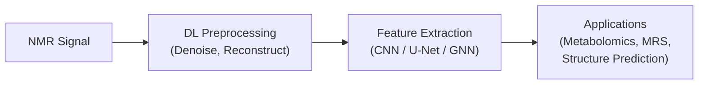
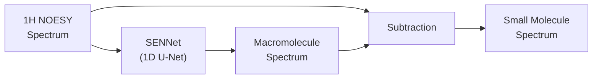
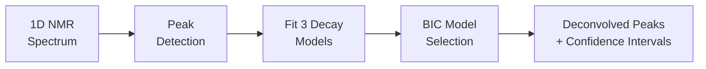
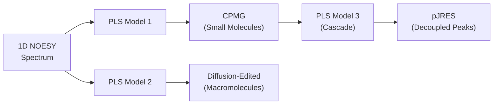
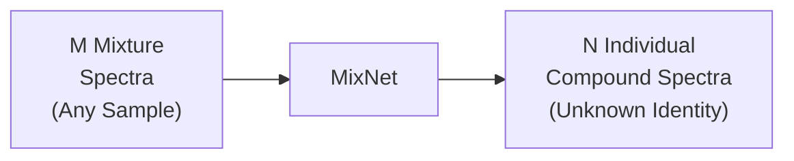
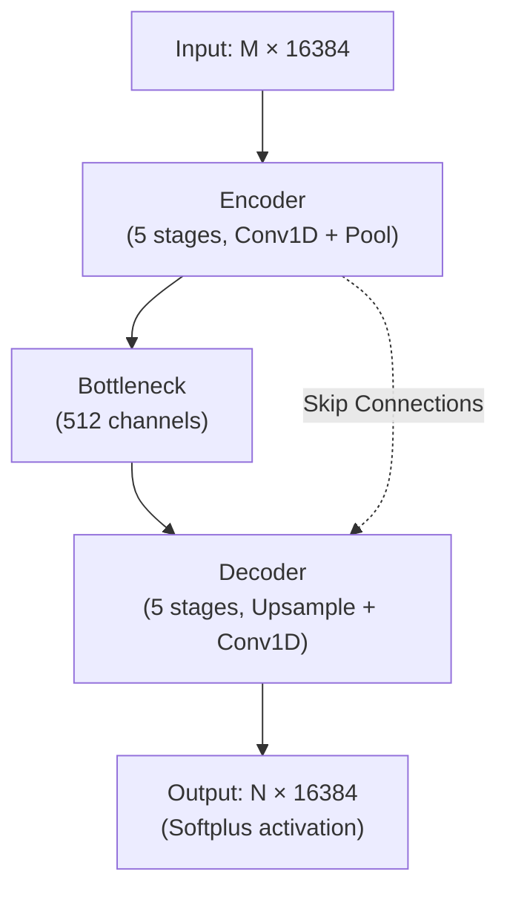
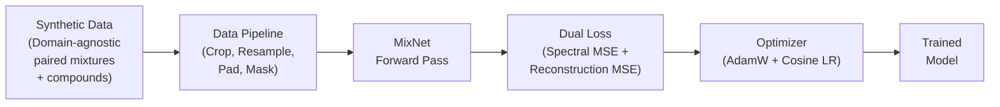
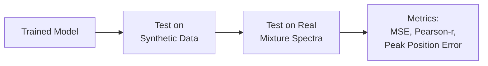

# Literature Review & Proposed Methodology

---

## Paper 1: Deep Learning in NMR (Review)
**Title:** Deep learning and its applications in nuclear magnetic resonance spectroscopy  
**Journal:** Progress in Nuclear Magnetic Resonance Spectroscopy (2025)  
**Authors:** Yao Luo, Xiaoxu Zheng, et al.

### Summary
Review paper covering all deep learning applications in NMR — NUS reconstruction, denoising, peak picking, chemical shift prediction, and structure elucidation. DL reduces acquisition time by 75–90% and eliminates operator bias.

### Overview

---

## Paper 2: SENNet — Spectral Editing Neural Network
**Title:** Using neural networks to obtain NMR spectra of both small and macromolecules from blood samples in a single experiment  
**Journal:** Communications Chemistry (2024)  
**Authors:** Xiongjie Xiao, et al.

### Summary
1D U-Net trained on synthetic data to separate macromolecule and small-molecule signals from a single blood NOESY spectrum. Achieved 92.6% Pearson correlation with experimental CPMG spectra.

### Pipeline

---

## Paper 3: NMR-Onion — Multi-Model Deconvolution
**Title:** NMR-Onion — a transparent multi-model based 1D NMR deconvolution algorithm  
**Journal:** Heliyon (2024)  
**Authors:** Mathies Brinks Sørensen, et al.

### Summary
Classical (non-DL) deconvolution algorithm. Uses 3 time-domain decay models (Lorentzian, Pseudo-Voigt, Power Law) with BIC model selection and Wild Bootstrap uncertainty quantification.

### Pipeline

---

## Paper 4: 3 Spectra from 1 Experiment
**Title:** Deriving three one dimensional NMR spectra from a single experiment through machine learning  
**Journal:** Nature Communications (2025)  
**Authors:** Alessia Vignoli, Stefano Cacciatore, Leonardo Tenori

### Summary
PLS regression on 1,753 real serum spectra to predict CPMG, Diffusion-edited, and pJRES from a single NOESY experiment. CPMG prediction: R² = 0.995. Cascade strategy (NOESY → CPMG → pJRES) outperforms direct prediction.

### Pipeline

---
---

# Proposed Approach: MixNet — General-Purpose NMR Spectral Decomposition

## Problem
Given **M mixture NMR spectra** from any sample (biological, botanical, pharmaceutical, etc.), decompose them into **N individual pure compound spectra** — without prior knowledge of the compounds' identities.

This is a **domain-agnostic Blind Source Separation (BSS)** problem. The model does not identify or name compounds — it separates their spectral contributions.

### Potential Applications
- **Blood metabolomics** — metabolite-level decomposition
- **Plant extract analysis** — isolation of unknown phytochemicals
- **Drug formulations** — component separation
- **Novel compound discovery** — isolated spectra that do not match existing databases may indicate previously uncharacterized compounds

---

## Architecture (1D U-Net, 7.1M parameters)

| Parameter | Value |
|-----------|-------|
| Spectral Length | 16,384 points (0–10 ppm) |
| Encoder Channels | 64 → 128 → 256 → 256 → 512 |
| Pooling | kernel=4, stride=4 |
| Output Activation | Softplus (non-negative) |

---

## Training Pipeline

---

## Validation

---

## Comparison with Reference Papers

| Feature | SENNet (Paper 2) | Nature Comms (Paper 4) | MixNet (Proposed) |
|---------|-----------------|----------------------|-------------------|
| **Scope** | Blood-specific (2 classes) | Blood serum (3 spectrum types) | **Domain-agnostic (any sample)** |
| **Goal** | Macro vs. Small molecule separation | Predict 3 spectrum types from NOESY | **Decompose into N unknown compounds** |
| **Architecture** | 1D U-Net | PLS Regression | 1D U-Net (7.1M params) |
| **Input** | 1 spectrum | 1 NOESY spectrum | M mixture spectra |
| **Output** | 1 macromolecule spectrum | 3 predicted spectra | N pure compound spectra |
| **Compound Identity** | Category-level (broad vs narrow) | Experiment-type level | **Not required — pure BSS** |
| **Training Data** | Synthetic (FID) | Real serum (n=1753) | Synthetic (Gaussian peaks) |
| **Discovery Potential** | Limited | None | **Novel compound discovery possible** |
